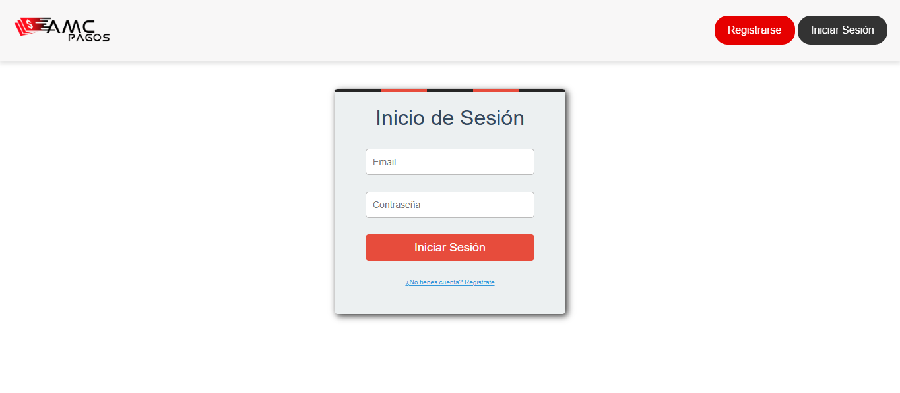
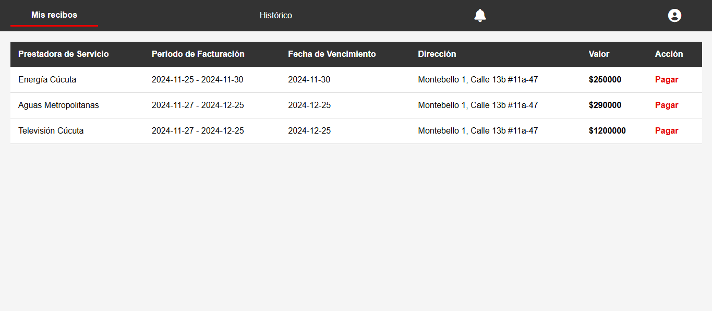

# 📑 Gestión de Recibos Públicos

Este proyecto es una **aplicación web** para la gestión de recibos de servicios públicos (bills) de casas y negocios en **Cúcuta**.  
Permite a los usuarios **registrar, consultar y administrar** sus recibos de manera eficiente y centralizada.

---

## 🚀 Tecnologías utilizadas

- **Java** → Lenguaje principal para la lógica de negocio.  
- **Spring Boot** → Framework para crear aplicaciones web en Java.  
- **Maven** → Herramienta de gestión de dependencias y construcción del proyecto.  
- **Spring MVC** → Gestión de rutas (endpoints) y controladores.  
- **Sesiones HTTP** → Para mantener la autenticación y el estado del usuario durante la navegación.  

---

## 📌 Funcionalidades principales

### ➕ Gestión de Recibos (Bills)

- **POST `/admin/addBill`**  
  - Añade un nuevo recibo.  
  - Recibe datos desde un formulario, los valida y guarda en la base de datos.  

### 👤 Gestión de Sesiones

- Autenticación de usuarios mediante sesiones HTTP.  
- Cada recibo queda asociado a la cuenta del usuario autenticado.  
- Garantiza que **cada usuario solo puede ver y administrar sus propios recibos**.  

---

## 📷 Screenshots

A continuación, puedes añadir capturas de pantalla de la aplicación para ilustrar su uso:

1. **Página de Inicio / Login**
   

2. **Listado de Recibos**
   

3. **Formulario de Nuevo Recibo**
   

3. **Perfil de usuario**


---

## ⚙️ Instalación y Ejecución

1. Clonar el repositorio:
   ```bash
   git clone https://github.com/tu-usuario/gestion-recibos.git
   cd gestion-recibos

2. Construir el proyecto con Maven:
   ```bash
   mvn clean install

3. Ejecutar la aplicación:
   ```bash
   mvn spring-boot:run

4. Abrir en el navegador:
👉 http://localhost:3000
